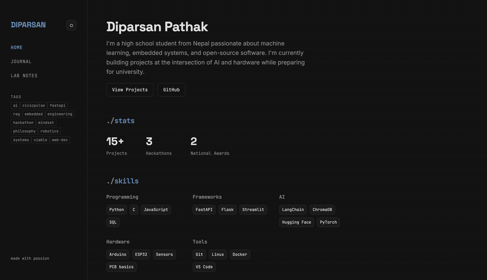
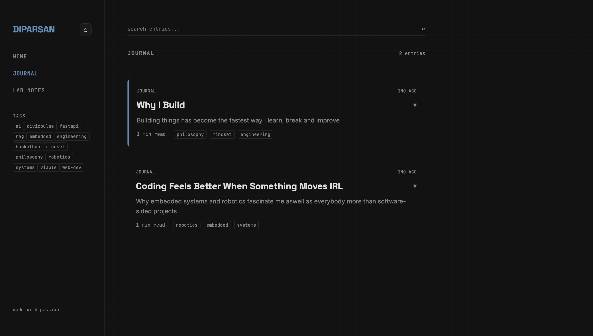
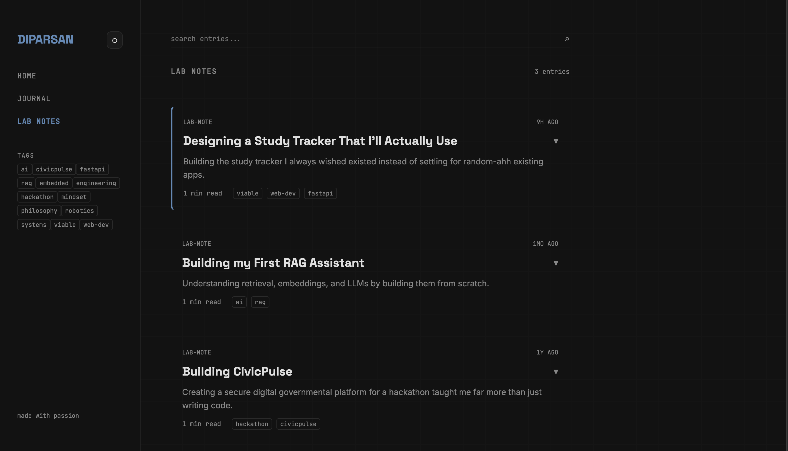

# Notebook
> my take on Build In Public

[**live Demo**](https://diparsan79.github.io/notebook/)

I buil this space to document my projects, experiments, failures, and the random ideas that keep me up at night. Instead of relying on random third party platforms for my journal.

## whats in it
- **landing page**: just an about me kinda page for some details about me


- **journal**: my general thoughts, plans , and my project ideas will be entried here.

- **Lab Notes**: Detailed plannng and breakdowns of my projects and research and experience.



- **Live Search & Tags**: Instant filters through entries without page reloads.

- **Dark/Light Mode**: Its lowk mandatory (AN UNSUNG RULE)


- **GitHub Integration**: Fetches real-time repo and commit activity directly from the GitHub API.


## How it works (adding new content in the site)
```javascript
    {
    id: 6,
    type: "journal", // or "lab-note"
    date: "YYYY-MM-DD",
    title: "Title",
    preview: "A short snippet of what the post is about...",
    tags: ["tag1", "tag2"],
    pinned: false,
    body: `
        <p>Actual post content written in HTML...</p>
    `
    }
```

## 💻 Local Setup

Since there's no build step or backend, running this locally takes about two seconds.

1. Clone the repo:
   ```bash
   git clone https://github.com/Diparsan79/notebook
   ```
2. Navigate to the directory:
   ```bash
   cd notebook
   ```
3. Open `index.html` in your browser, or spin up a quick local server (e.g., using VS Code Live Server or Python):
   ```bash
   python3 -m http.server 8000
   ```

   YAY!! the site is now locally running in your computer

This project was a great initiation of my web-dev journey. 
I learned many concepts and i am currently very motivated to making projects with my web-dev experience and FASTAPI knowledge.